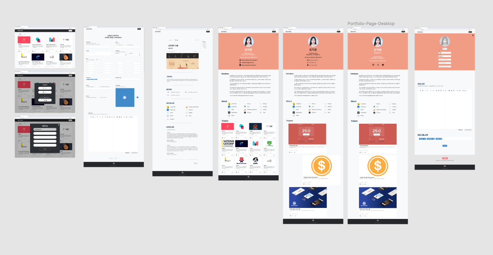
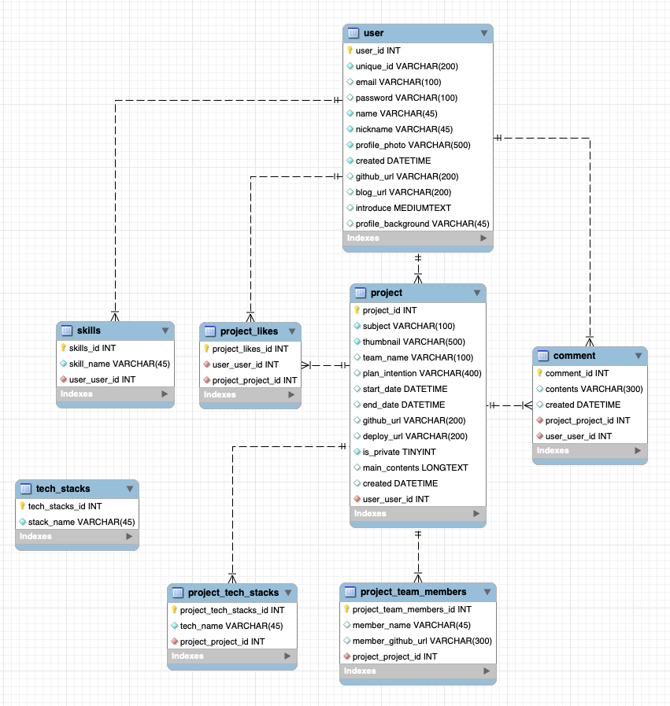
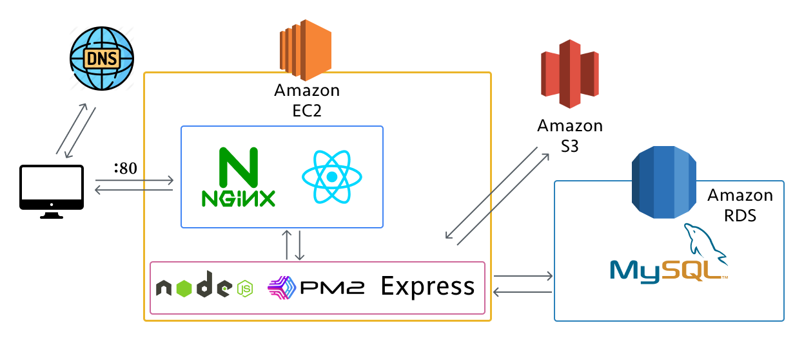
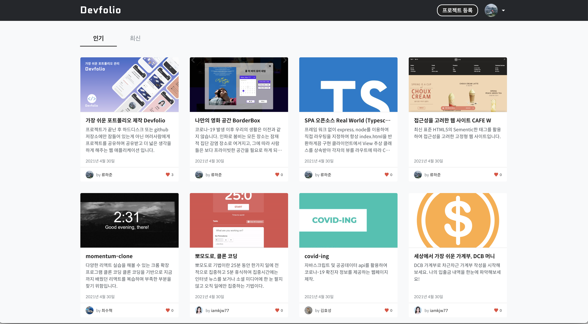
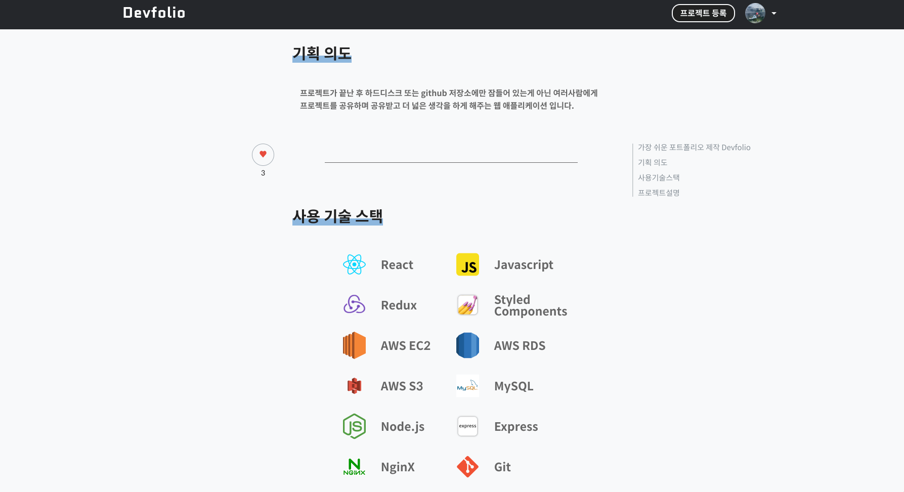

# 가장 쉬운 포트폴리오 관리 Devfolio 🖥


## [🏠 HOME PAGE](http://devfolio.world)
## [📜 Devfolio Wiki](https://github.com/Devfolio-team/Devfolio-Client/wiki)

## 🐣 기획 의도
프로젝트가 끝난 후 하드디스크 또는 github 저장소에만 잠들어 있는게 아닌 여러사람에게 프로젝트를 공유하며 공유받고 더 넓은 생각을 하면 좋겠다는 취지에서 개발한 웹 애플리케이션 입니다.

## 🔥 프로젝트 목표
- 패스트 캠퍼스 프론트엔드 개발스쿨 과정에서 학습한 HTML5, CSS3, Javascript, React, Redux등의 지식들을 모두 활용하여 프로젝트에 임합니다. 
- 결과보다 과정, 기술적 부채를 남기지 않으며 작업하는 습관을 키웁니다.
- 단순 토이 프로젝트가 아닌 팀원들과의 협업과정을 문서로 남기며 체계적으로 작업합니다.
- 접근성을 고려하여 일반적인 사용자뿐만 아니라 환경적으로 장애가 있는 사용자도 이용할 수 있는 웹 애플리케이션을 만듭니다.
- 디자인부터 개발, 배포의 과정까지 겪으며 간접적으로 서비스의 런칭을 경험합니다.

## 🌈 UI 디자인
Figma 디자인 툴을 이용하여 프로젝트의 디자인 시안을 제작했습니다.




## ✨ 기술 스택


## 💾 DB Model

### [👉 Devfolio API Endpoints 보러가기 👈](https://documenter.getpostman.com/view/14334640/TzJuBdik#15f68764-6186-4364-888f-65487d5713ac)  



## 📡 서비스 구성도


## 🕹 프로젝트 주요 기능

### 전체 프로젝트 인기 / 최신 조회


### 프로젝트 상세 조회(썸네일)


### 프로젝트 상세 조회(기획의도, 기술스택)


### 프로젝트 상세 조회(프로젝트 설명)


### 포트폴리오(기술스택 typewriter effect)


### 포트폴리오(자기소개, 기술스택)


## 👨‍👦‍👦 Devfolio와 함께한 사람들
| [류하준(HajunRyu)](https://github.com/HaJunRyu) | [신봉철(Bcroun)](https://github.com/bcround) | [최수혁(choisuhyeok1255)](https://github.com/choisuhyeok1255) |
|:---:|:---:|:---:|
|  |  |  |

## [👉 프로젝트 발표 자료 👈](https://docs.google.com/presentation/d/1biG5F-HUbESvyYUK9wFcwMIHiabt5QbaZO5YAlsq9CE/edit?usp=sharing)


## 🚀 프로젝트 사용법
```sh
npm i
npm start
# or
yarn add
yarn start
```

**root경로에 .env파일이 필요합니다.**
```sh
# /.env
REACT_APP_API_URL=[API url]
```